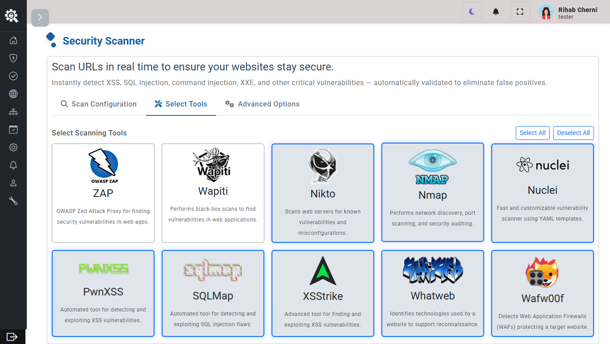

# pfe-AutoTest
Automated Testing Platform  

    

## Overview
**AutoTest** is an all-in-one automated testing platform that unifies **functional testing**, **SEO audits**, and **security penetration testing** into a single workflow.  
It enables teams to streamline test execution, track results in real-time, and centralize reporting for better decision-making.

## Architecture
- **Frontend (Angular)** → User-friendly interface to configure and launch tests  
- **Backend (FastAPI)** → API for test orchestration, vulnerability detection, SEO analysis, and reporting  
- **Database (PostgreSQL)** → Stores test scenarios, results, and reports  
- **Message/Notification Layer** → Slack, Email, Jira integrations  

    

---

## Features

### Functional Testing
- Workflow-based execution with **Selenium integration**  
- Automated UI testing for web applications  
- Support for reusable test scenarios  

### SEO Auditing
- Technical SEO analysis (meta tags, broken links, sitemaps, structured data)  
- Performance and accessibility scoring  
- Exportable SEO reports in **PDF/HTML**  

### Security & Pentesting
- Automated vulnerability scanning using tools: **OWASP ZAP, SQLMap, Nikto, Nuclei, OpenVAS**  
- Authenticated and unauthenticated scan support  
- Centralized vulnerability database with **risk classification**  
- **Jira/Slack integration** for issue reporting and notifications  

### Reporting & Notifications
- Unified dashboard with test results and vulnerability stats  
- Export reports in **PDF, HTML, JSON** formats  
- Integration with **Slack, Gmail, Jira** for notifications  

---

## Screenshots & Demos

### Home

    
    

### Authentication

    
    
    
    
    
    
    
    
    
    
    

### Dashboard View

    
    

### Functional Testing Workflow

    
    
    

### SEO Audit Report

    

### Pentest Scan Results

    
    
    
    
    
    
    
    
    

### Report Configuration (Jira, Gmail, Slack)

    
       
        
        
    
    

### Notifications

     
    
        

### Reports

    
    
    

### Scheduling

    

### User List

    

